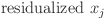
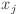
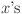
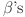
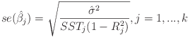

# Econometrics Cheat Sheet

Econometrics cheat sheet created using LaTeX with a summarized review of:

* **Basic econometrics concepts**: econometrics definitions, data type, phases of a model, regression and correlation analysis.
* **Assumptions and properties** of the linear regression model.
* **Ordinary Least Squares** (OLS) equations, coefficient interpretatation, error measures, r-squared.
* **Hypothesis testing and confidence intervals**.
* **Dummy variables and structural change**.
* **Predictions**.
* **Popular OLS problems** (multicollinearity, heteroscedasticity and auto-correlation): consequences, detection and correction.

### Download links

Current version: `2.2`

|         | PDF file | TeX file |
|---------|----------|----------|
| English |   [en.pdf](econometrics-cheatsheet/econometrics-cheatsheet-en.pdf)   |   [en.tex](econometrics-cheatsheet/econometrics-cheatsheet-en.tex)   |
| Spanish |   [es.pdf](econometrics-cheatsheet/econometrics-cheatsheet-es.pdf)   |   [es.tex](econometrics-cheatsheet/econometrics-cheatsheet-es.tex)   |

Opinions, ideas and collaboration proposals are heard through GitHub or by email (marcelomijas@gmail.com). Also, my [LinkedIn](https://www.linkedin.com/in/marcelomorenop/).

## Roadmap

:white_check_mark: Release of page 3 of econometrics-cheatsheet whith popular OLS problems.

:white_check_mark: Release of an Spanish version of the econometrics-cheatsheet.

:construction: Release of a cheat cheet exclusively dedicated to time series in the context of econometrics (time-series-cheatsheet).

## Frequently Asked Questions <!-- for LaTeX equations to .png use iTex2Img -->

### What does  means?

Those are the residuals from a OLS regression between  and all the other . Error meausres and r-squared can be obtained from this regression.

### Where is the non matrix version of the standard error of the ?

For space reasons, the version included in the cheatsheet is the matricial one. It is perfectly valid and equal to the non matrix version.

The non matrix version:

## Bibliography

In addition to the notes taken at the [Degree in Economics from the King Juan Carlos University](https://www.urjc.es/universidad/calidad/560-economia), the books used:

[1] Wooldridge, J. M. (2015). *Introductory econometrics: A modern approach*. Cengage learning.

[2] Damodar, N. G. (2004). *Basic Econometrics-Damodar N. Gujarati*. McGraw− Hill.

[3] Stock, J. H., & Watson, M. W. (2012). *Introduction to econometrics*. New York: Pearson.

[4] Baltagi, B. H. (2011). *Econometrics*. New York: springer.

[5] Gujarati, D. N., Porter, D. C., & Gunasekar, S. (2012). *Basic econometrics*. Tata McGraw-Hill Education.

[6] Ruiz-Maya, L., & Pliego, F. J. M. (2004). *Fundamentos de inferencia estadística*. AC.

[7] James, G., Witten, D., Hastie, T., & Tibshirani, R. (2013). *An introduction to statistical learning*. New York: springer.

## Contributions

* Reddit user \_bheg_ - Pointed out about the importance of including strong and weak exogeneity and their consequences on bias and consistency properties of OLS.
